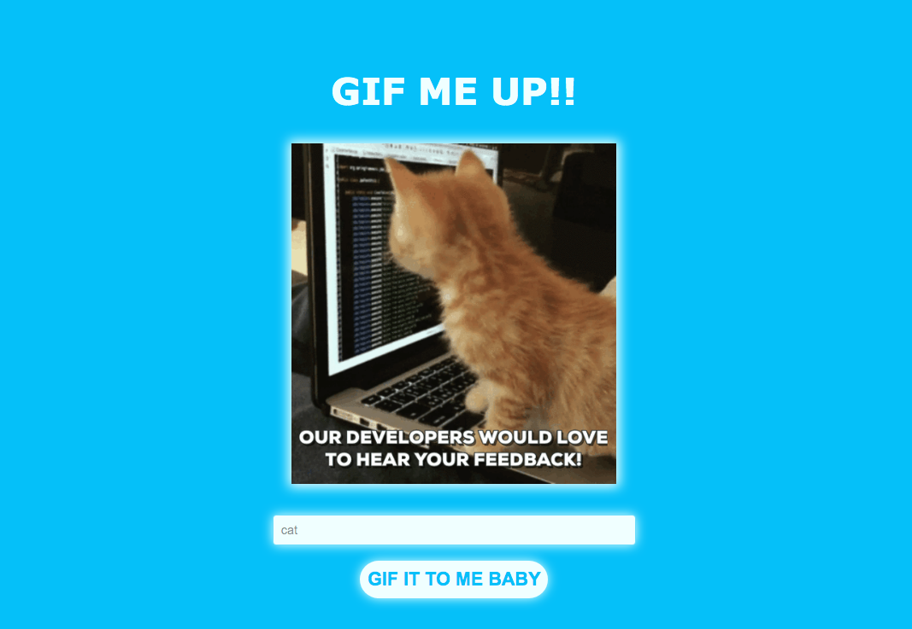

### Gif Me Up

This is a simply WebApp that uses a Gif API and generates random gifs from the click of a button. This was made to practice and understand the use of APIS and promises such as fetch, then and catch in web development.

This was created using pure Vanilla JS with basic styling.

## Table of contents

1. [Demo](#demo)
2. [Technologies](#technologies)
3. [Features](#features)
4. [Development](#development)
5. [License](#license)

## Demo

Here is the working live demo:
[https://benjamin-gambling.github.io/gif-me-up/](https://benjamin-gambling.github.io/gif-me-up/).

## Technologies

- Vanilla JS, ES6 , API's

## Features

- Randomly picks a gif to display at the click of button
- Search function that help the random generator be more specific with its selection, this is done by using the tags of the gifs
- If a search is invalid or an error occurs a 'error' gif is generated

### Development

- Age restricted gifs (G, PG , PG-13, R)
- Save gigs to be the first shown on loading of page
- Tweet Gif

## License

> You can check out the full license [here](LICENSE)

This project is licensed under the terms of the **MIT** license.
